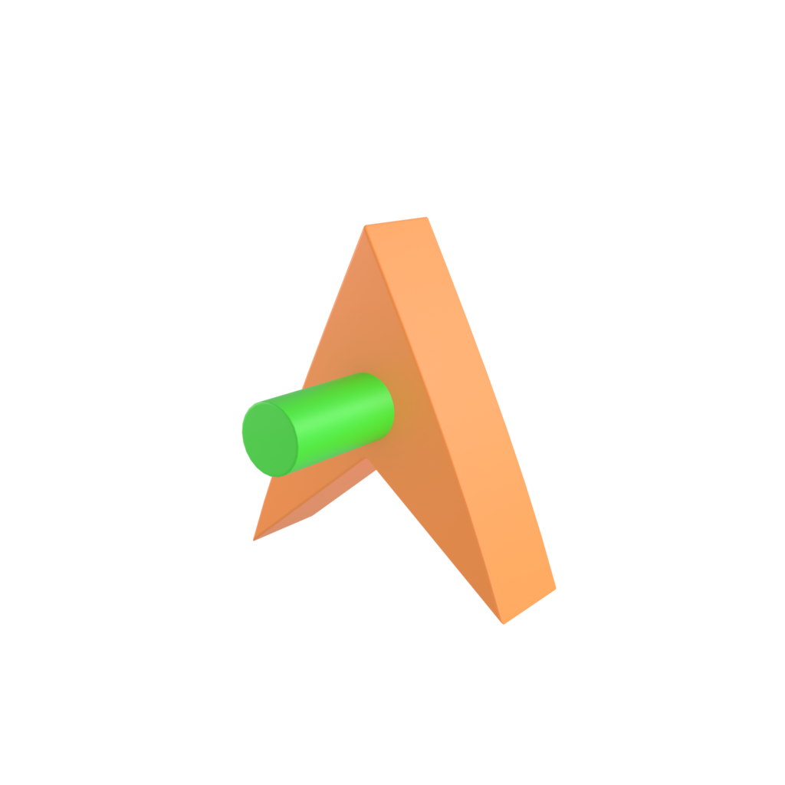
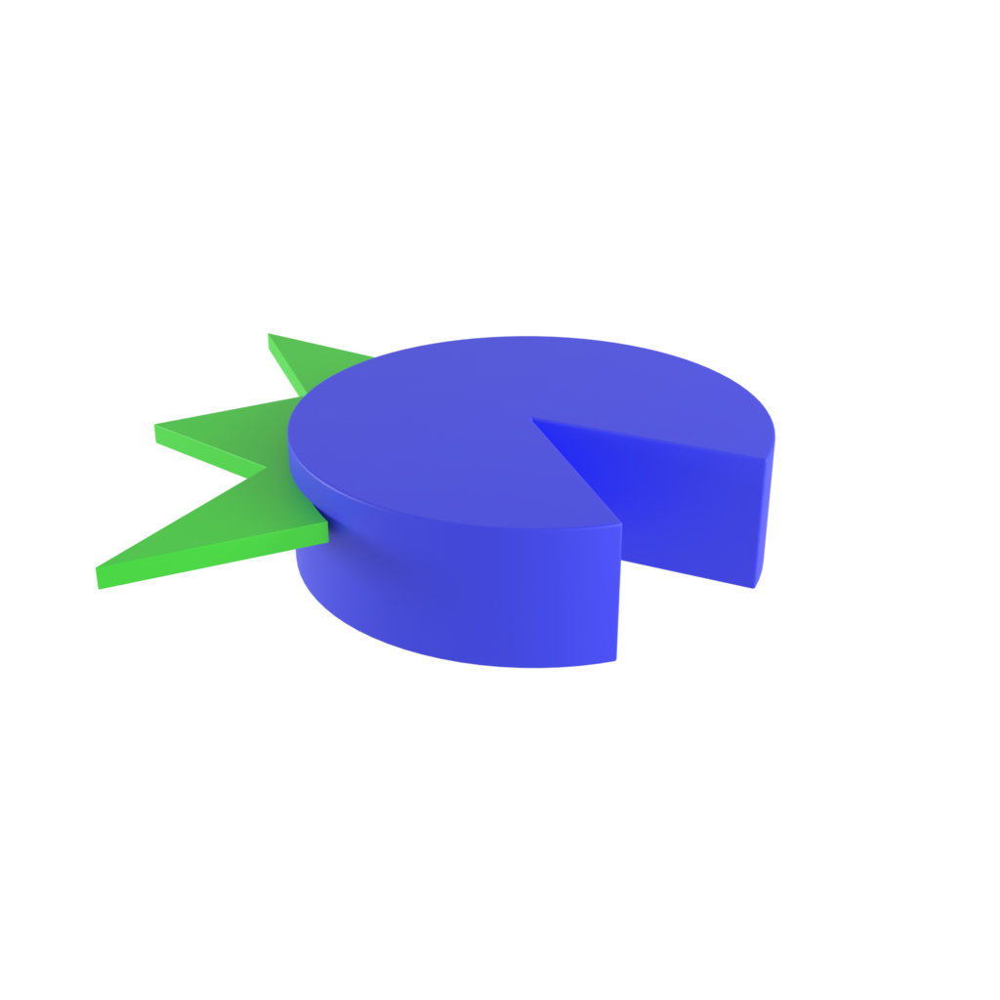
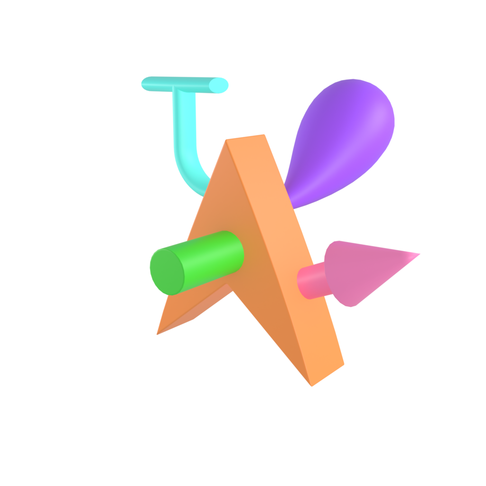
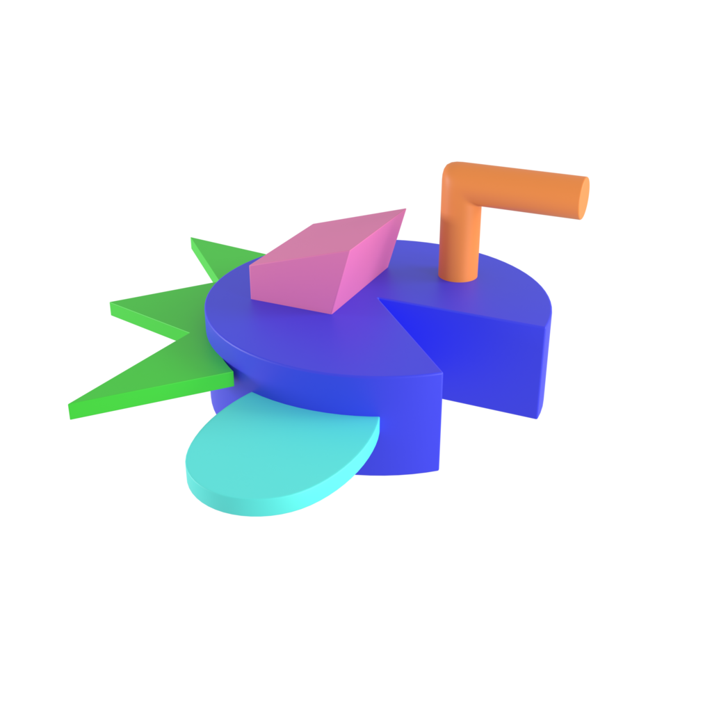
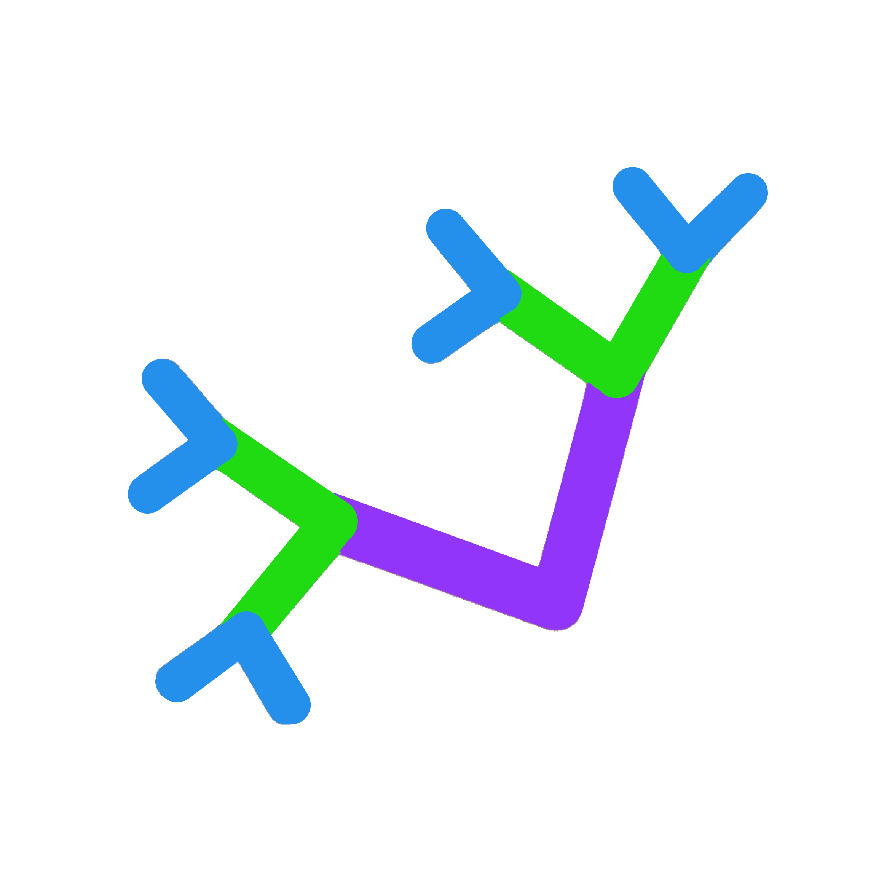
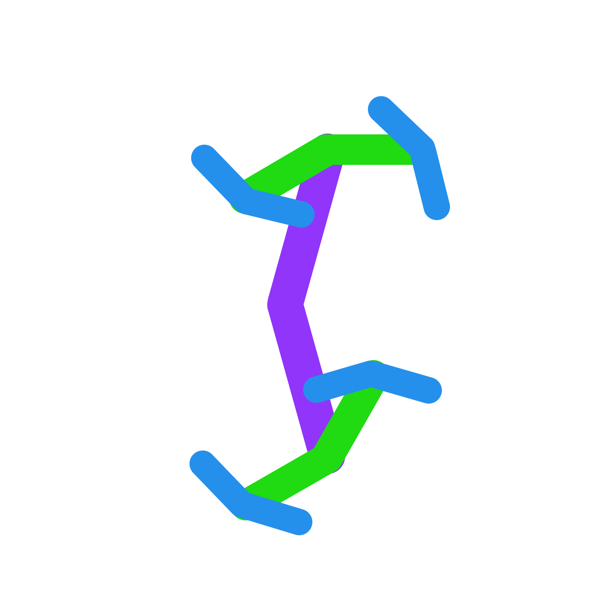
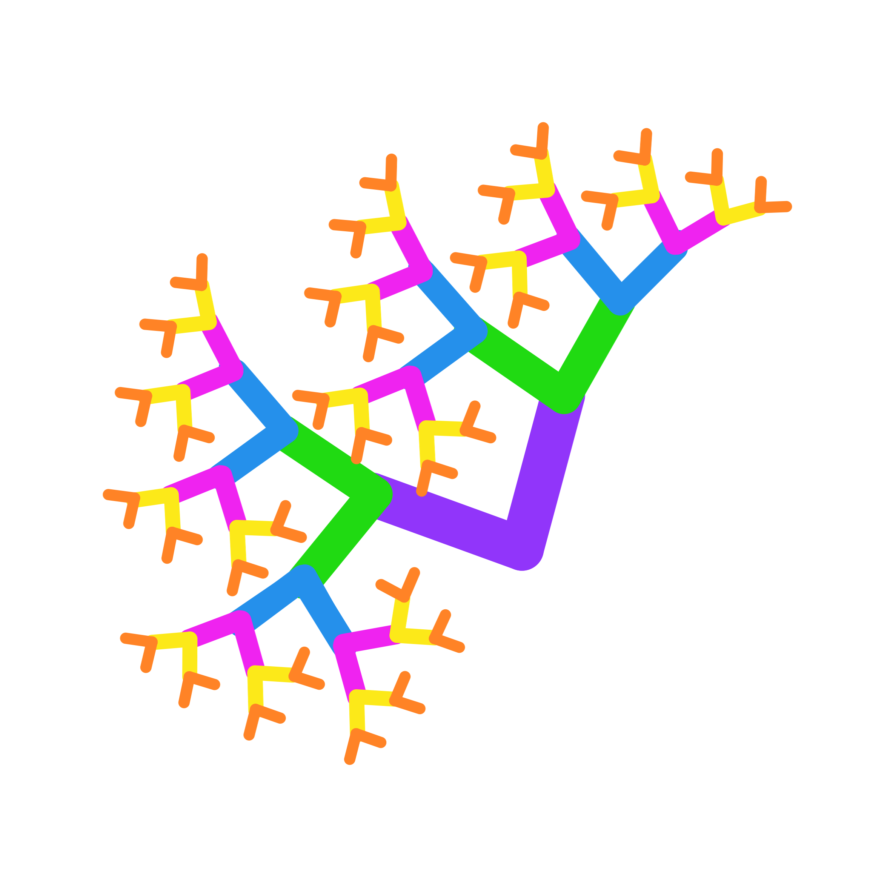
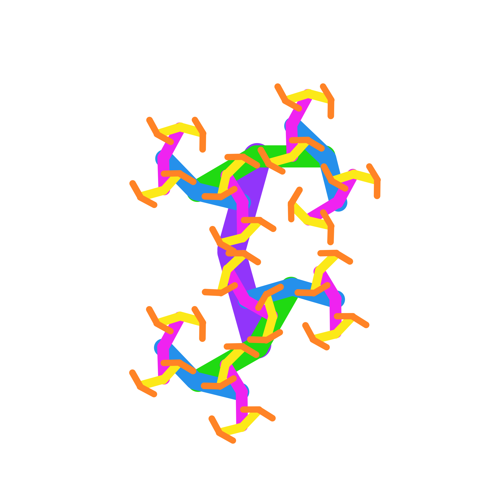

# Procedure {#sec-procedure}

::: {.callout-important}
## LABS SHOULD ADHERE TO THESE SPECIFICATIONS AS CLOSELY AS POSSIBLE 
**If any of the following technical specifications are not possible for your lab**, please contact the MB5 leadership team () as soon as possible and **BEFORE BEGINNING DATA COLLECTION** to inform us of your planned deviation and the reason for it.
:::

## Overview

Each baby will be presented with a series of 12 trials. Each trial is preceded by an attention-getter and made up of a **familiarization phase** followed by the **test phase** (see @fig-trial).

There are a total of 12 familiarization events for each infant that vary across three dimensions (see @tbl-familiarization):

1.  **Stimulus class** (*Fribbuli* or *Fractals*)
2.  **Complexity level** (*low* or *high*); and
3.  **Familiarization time** (*5s*, *10s*, or *15s*)

#### There are two versions of the experiment:^[Participating labs are encouraged to use an infant-controlled design, if possible. See @sec-famphase for more info.]

1.  ***Infant-controlled design***, in which the familiarization phase of each trial lasts until the infant accumulates the target familiarization looking time (5s, 10s, or 15s), or until the max trial duration *(2x target familiarlization time)* is reached. 
2.  ***Fixed-length design***, in which the duration of the familiarization phase is pre-established (5s, 10s, or 15s) regardless of infant looking time.

In both versions, the duration of each test period is fixed at 5s (10s total per trial).

## Trial Structure

![This figure depicts the design of an example trial. During familiarization, a single image is shown until the specified familiarization time is reached (based on the *infant-controlled* or *fixed-length* design criteria; 5, 10, or 15s). During the two test periods (5s each), infants view the same image they saw during familiarization paired with a new stimulus from the same set (e.g., *ManyFribbles* or *ManyFractals*) and the same level of complexity (*low* or *high*). The side on which the familiar and novel images are presented is counterbalanced across test phases within a trial, but the images remain the same.](images/mb5-trial-schematic.png){#fig-trial}

### Pre-Trial Attention-Getter

Infants’ attention is drawn to the center of the screen using the `laughing baby` stimulus. An experimenter initiates the trial via key press when the infant fixates the screen (or a maximum of 10s has elapsed).^[This maximum duration is to allow the experiment to proceed and not get "stuck" on the attention-getting stimulus for too long, even if the baby is inattentive.]

### Familiarization Phase {#sec-famphase}

Once the trial has been initiated, one *familiarization* stimulus is presented centrally on the screen and is accompanied by music that plays continuously during the familiarization phase.^[Pilot testing indicated that music helped infants stay engaged in the task] 

The familiarization stimulus remains on the screen until the familarization criterion^[Criterion depends on *fixed-length* or *infant-controlled* design] has been met: 

* ***Fixed-length design:*** The familiarization time has elapsed.
* ***Infant-controlled design:*** The infant has accumulated the target duration of looking (as determined by automated gaze detection by an eye-tracker or by an experimenter coding infant looking in real time) ***OR*** the maximum trial length *(2x the target duration of looking)* has elapsed.
  * *NOTE:* Familliarization looking does not have to be continuous. Infants may accumulate the required familiarization time across multiple looks (e.g., "infant looks to the screen for 3s, looks away for 2s, looks back for 2s" would satisfy the familiarization criteria for a 5s trial).

### Pre-Test Attention-Getter 
Once the familiarization criterion has been reached (either via fixed-length presentation, accumulated looking, or maximum trial duration), the infant is presented with a central-fixation stimulus (`looming circle`). An experimenter initiates the test phase via key press when the infant fixates the screen (or a maximum of 5s has elapsed).

::: {.callout-caution}
CONFIRM AG MAX DURATION OF 5s
:::

### Test Phase {#sec-testphase}

The **test phase** is made up of **two test periods**. Each test period lasts for a fixed duration of 5s (regardless of design^[*fixed-length or infant-controlled] or infant looking).

In the **first test period**, the stimulus seen during familiarization (the *familiar* stimulus) is presented side-by-side with a previously-unseen *novel* stimulus. The *novel* stimulus will be from the same stimulus class (*Fribbles* or *Fractals*) and complexity level (*low* or *high*) as the *familiar* stimulus.  

Following the first test period, the fixation stimulus (`looking circle') is again presented in the center of the screen for a **fixed duration of 750ms**. This attention-getter is followed by the second test period.

::: {.callout-caution}
CONFIRM AG DURATION OF 750ms
:::

The **second test period** is identical to the first with the exception that the *familiar* and *novel* stimuli switch sides. For example, if the *familiar* stimulus appeared on the left side of the screen in the first test period, it will appear on the right side of the screen in the second test period. 

Following the conclusion of the second test period, the Pre-Trial Attention-Getter (`laughing baby`) re-appears on the screen until the initiation of the the next trial.

***

## Trial Orders

Each infant will view both stimulus sets (*ManyFribbles* and *ManyFractals*), with presentation blocked by stimulus set and presentation order (ie.g., Fribbles first or Fractals first) and counterbalanced across infants. Additionally, within each stimulus set, infants will experience all combinations of complexity level (*low*, *high*) and familiarization time (*5s*, *10s*, *15s*). @tbl-familiarization provides an example list of the 12 trial types that an infant would see, with example stimuli for each trial type shown in the right-most columns. 

Project Leads have generated a set of **XXX** order lists which counterbalance many variables (e.g., *block order*, *stimulus* x *complexity level* x *familiarization time* combinations, *novel side during test periods*) both within and across labs. Each lab will be assigned a set of 16 orders at the time of "Green-Lighting" to use for testing. For labs collecting sample sizes larger than 16, orders can be used more than once.

::: {.callout-important}
## PLEASE USE THE ORDERS ASSIGNED TO YOUR LAB! 
It is **VERY IMPORTANT FOR COUNTERBALANCING PURPOSES** that each lab use the orders assigned to them by Project Leads. If you are having difficultly implementing assigned orders, please [**EMAIL US**]() as soon as possible so that we can assist you. Thank you!
:::

<!-- Table of trial types -->
| Trial | Familiarization Time (s) | Stimulus Class | Complexity Level | Familiarization Stimulus | Test Stimulus (novel) |
|-------|--------------------------|----------------|------------------|--------------------------|--------------|
| **1   2   3** | 5   10   15 |   ManyFribbles |   Low | </img> | </img>|
| **4   5   6** | 5   10   15 |   ManyFribbles |   High | </img> |  </img>|
| **7   8   9** | 5   10   15 |   ManyFractals |   Low | </img> |</img>|
| **10   11   12** | 5   10   15 |   ManyFractals |   High | </img> | </img>|

: Example trial information for a participant  {#tbl-familiarization}

> *Note:* The order of blocks and trials will be counterbalanced along a number of dimensions across participants and labs. 
