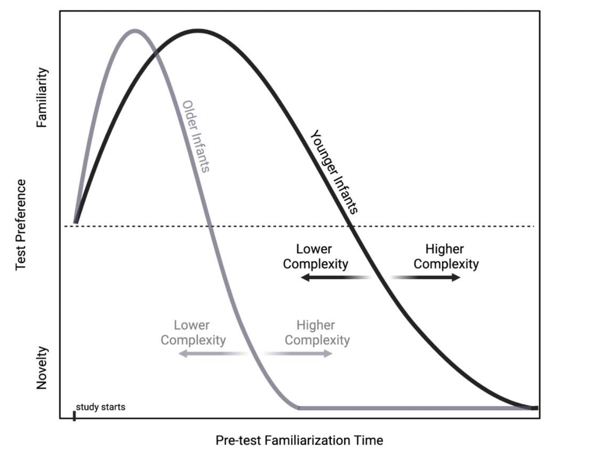

--- 
title: "ManyBabies 5 Lab Manual"
subtitle: "DRAFT - DO NOT USE"
# author: "compiled by ManyBabies 5 Leads"
date: "Updated: `r Sys.Date()`"
site: bookdown::bookdown_site
documentclass: book
bibliography: [refs.bib, packages.bib]
biblio-style: apalike
# url: your book url like https://bookdown.org/yihui/bookdown
cover-image: images/mb5-logo.png # this doesnt' appear to be doing anything?
description: |
  This is the lab manual for labs participating in the ManyBabies 5 project.
link-citations: yes
github-repo: manybabies/mb5-manual
---

# Overview {-}

{width=25%}   {width=25%}


#### Thank you for contributing to [**ManyBabies 5**](https://manybabies.org/MB5/), a project of [**ManyBabies**](https://manybabies.org/)! {-}

MB5 is a cross-lab effort to provide an empirical basis for discussions of replicability as well as cultural, developmental, and methodological variability in infant perception/cognition research. In this project, we are examining drivers of infants’ familiarity vs. novelty preference through a collaboratively-designed “best test” of a popular model of infants’ visual preference for familiar and novel stimuli^[@hunterames]. More details about the background, design and hypotheses can be found in the [**Registered Report**](https://osf.io/preprints/psyarxiv/ck3vd)^[@kosiezettersten2024]. In the following sections, we provide instructions on how to implement the experiment in your lab and report data back to the project as a whole. Thanks for joining us!


```{r echo = FALSE, fig.align='center',  out.width = '75%', fig.cap='Hunter and Ames model of infant attention (adapted from Bergmann and Cristia, 2016)'}

```

***

<a rel="license" href="http://creativecommons.org/licenses/by-nc/4.0/"></a><br />This work is licensed under a <a rel="license" href="http://creativecommons.org/licenses/by-nc/4.0/">Creative Commons Attribution-NonCommercial 4.0 International License</a>.

***

## Important links {-}

* #### <a href="https://docs.google.com/document/d/1dZ3sF2UcxvpkfOfKSKFeObTMZRbpUYloMUiPYtZy0ng/edit?usp=sharing" target="_blank">ManyBabies General Manual</a> {-}
* #### <a href="https://doi.org/10.31234/osf.io/ck3vd" target="_blank">MB5 Stage 1 Registered Report</a> {-}
* #### <a href="https://manybabies.org/MB5/" target="_blank">MB5 project website</a> {-}
* #### <a href="https://docs.google.com/document/d/1vbTDmH6euda5pJN4uyds3zsnQ1DXrW9wpHogwC-5TSk/edit?usp=sharing" target="_blank">MB5 collaboration agreement</a> {-}
* #### <a href="https://docs.google.com/forms/d/e/1FAIpQLSfXoKjJo3XgGuXCLhWhzEDz0UrJ7tmio-70SoS24g4vqc4Utg/viewform?usp=sf_link" target="_blank">MB5 issue tracker form</a> {-}
* #### <a href="https://docs.google.com/forms/d/e/1FAIpQLScunCYwrJApObng6xVV_lN4CUrcLrsrAKmiBmia67vPc9jNTA/viewform?usp=sf_link" target="_blank">MB5 documentation upload form </a>  {-}
* #### <a href="https://docs.google.com/forms/d/e/1FAIpQLSeydFOC2LviKVBhHEpExH5SEJsqH0705pxH8gwHsPDN13Qk6Q/viewform?usp=sf_link" target="_blank">MB5 data upload form</a>  {-}


## Contact info {-}
* ##### MB5 general contact: [mb5@manybabies.org](mailto:mb5@manybabies.org) </b> {-}
* ##### Jessica Kosie (Project Lead): [jkosie@asu.edu](mailto:jkosie@asu.edu)
* ##### Martin Zettersten (Project Lead): [mzettersten@ucsd.edu](mailto:mzettersten@ucsd.edu)
* ##### Casey Lew-Williams (Project Lead): [caseylw@princeton.edu](mailto:caseylw@princeton.edu)
* ##### Heidi Baumgartner (MB Exec. Director): [heidib@manybabies.org](mailto:heidib@manybabies.org)


## Data collection period {-}
MB5 data collection is scheduled to run between the following dates:

#### *Start Date:* **2024-MM-DD** {-}

#### *End Date:* **2025-MM-DD** {-}

It is essential that all participating labs do their best to collect data prior to the End Date. However, we understand that there may be disruptions to data collection for various reasons. If you are having trouble meeting this timeframe, please alert the leadership team ([mb5@manybabies.org](mailto:mb5@manybabies.org)) as soon as possible to discuss options. 

<br>

**Labs may join the MB5 project any time during the data collection period, provided:**

* They commit to completing data collection by the specified end date, and 
* A formal “green-light” for testing is obtained 


## MB5 Lab Checklist {-}

These are the steps that every data-collecting lab must follow to participate in MB5. More detail for each checklist item is available in the linked manual sections.

**BEFORE you do ANYTHING else:**

1. Complete the <a href="https://docs.google.com/forms/d/e/1FAIpQLSdJnP3KO_dCmj-jNPHs0XP2j3q66g1RI6L31dwhCzhwhoJeoA/viewform" target="_blank"><b>ManyBabies 5 Initial Sign-Up Form</b></a>.
2. Read the <a href="https://docs.google.com/document/d/1vbTDmH6euda5pJN4uyds3zsnQ1DXrW9wpHogwC-5TSk/edit?usp=sharing" target="_blank"><b>MB5 Collaboration Agreement</b></a>.
3. <b>Read this manual start to finish</b> and review the information in the <a href="https://docs.google.com/document/d/1dZ3sF2UcxvpkfOfKSKFeObTMZRbpUYloMUiPYtZy0ng/edit?usp=sharing" target="_blank"><b>ManyBabies General Manual</b></a> regarding <a href="https://docs.google.com/document/d/1dZ3sF2UcxvpkfOfKSKFeObTMZRbpUYloMUiPYtZy0ng/edit#heading=h.22i70rxou3ha" target="_blank">ethical research</a>, <a href="https://docs.google.com/document/d/1dZ3sF2UcxvpkfOfKSKFeObTMZRbpUYloMUiPYtZy0ng/edit#heading=h.9ty2g48mpe0t" target="_blank">authorship</a>, <a href="https://docs.google.com/document/d/1dZ3sF2UcxvpkfOfKSKFeObTMZRbpUYloMUiPYtZy0ng/edit#heading=h.aunbjkpwxhf3" target="_blank">data sharing</a>, and <a href="https://docs.google.com/document/d/1dZ3sF2UcxvpkfOfKSKFeObTMZRbpUYloMUiPYtZy0ng/edit#heading=h.6h67zsyeiveg" target="_blank">data use</a>. 

**BEFORE you begin data collection:**

4. [**Set up your study**][Setting up the experiment] in consultation with this lab manual. Decide on your planned sample size/stopping rule. Carefully record any needed deviations from the protocol using the <a href="https://docs.google.com/forms/d/e/1FAIpQLSfXoKjJo3XgGuXCLhWhzEDz0UrJ7tmio-70SoS24g4vqc4Utg/viewform?usp=sf_link" target="_blank"><b>MB5 issue tracker form</b></a>.
5. Complete the <b>Laboratory Questionnaire</b> [INSERT LINK], 
6. Submit [**ethics approval**] and other documentation/materials using the <a href="https://docs.google.com/forms/d/e/1FAIpQLScunCYwrJApObng6xVV_lN4CUrcLrsrAKmiBmia67vPc9jNTA/viewform?usp=sf_link" target="_blank"><b>MB5 documentation upload form</b></a>. 
7. Create and submit your [**walkthrough video**][Walkthrough video].
8. Run pilot sample through the <a href="https://manybabies.org/validator/" target="_blank"><b>Data Validator</b></a>.
9. Send email to [mb5@manybabies.org](mb5@manybabies.org) to let the leadership team know that you are ready for “green-lighting”. 
10. **Wait for your official “green-light”** from the leadership team to begin data collection.

**Data collection:**

11. Collect your data! 
  + *IMPORTANT: DO NOT begin data collection (other than piloting) until you have been explicitly (and individually) “green-lighted” to do so.*
  
**AFTER you finish data collection:**

12. Complete your participant and trial data files in consultation with the data reporting instructions "[Data reporting guidelines]."
13. Submit your data using the [MB5 data upload form](https://docs.google.com/forms/d/e/1FAIpQLSeydFOC2LviKVBhHEpExH5SEJsqH0705pxH8gwHsPDN13Qk6Q/viewform?usp=sf_link).
14. Report contributions using the [MB Contribution Reporting Form](https://manybabies.org/credit/)


```{r eval=FALSE, include=FALSE}
bookdown::serve_book()
```


```{r include=FALSE}
# automatically create a bib database for R packages
knitr::write_bib(c(
  .packages(), 'bookdown', 'knitr', 'rmarkdown'
), 'packages.bib')
```
