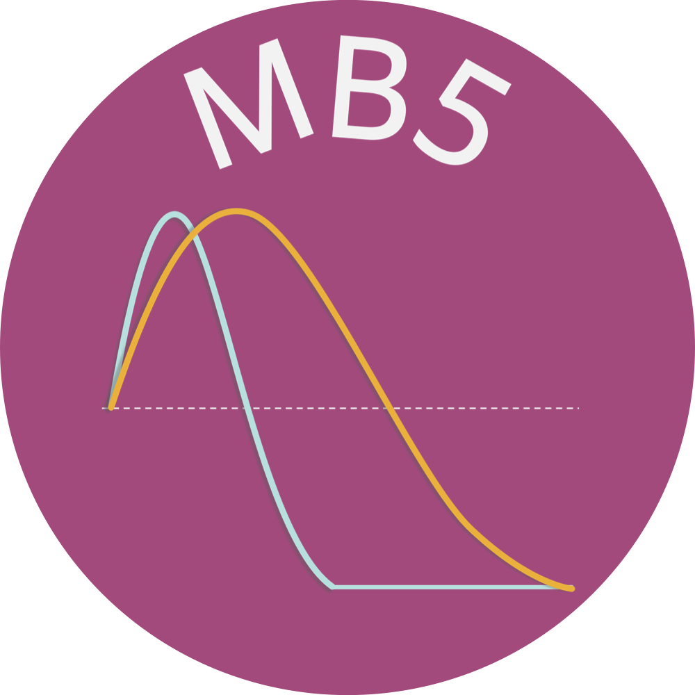

--- 
title: "ManyBabies 5 Lab Manual - DRAFT - DO NOT USE"
subtitle: "Primary Manual for Participating Laboratories"
author: "ManyBabies 5 Leads"
date: "Updated: `r Sys.Date()`"
site: bookdown::bookdown_site
documentclass: book
bibliography: [book.bib, packages.bib]
biblio-style: apalike
# url: your book url like https://bookdown.org/yihui/bookdown
# cover-image: path to the social sharing image like images/cover.jpg
description: |
  This is a minimal example of using the bookdown package to write a book.
  The HTML output format for this example is bookdown::gitbook,
  set in the _output.yml file.
link-citations: yes
github-repo: manybabies/mb5-manual
---


{width=30%}   {width=30%}

# Overview

### Primary Manual for MB5 Participating Laboratories

Thank you for contributing to [ManyBabies 5](https://manybabies.org/MB5/) (MB5), a project of [ManyBabies](https://manybabies.org/), a cross-lab effort to provide an empirical basis for discussions of replicability as well as cultural, developmental, and methodological variability in infant perception/cognition research. In this project, we are examining drivers of infants’ familiarity vs. novelty preference through a collaboratively-designed “best test” of Hunter and Ames’ (1988) model of infants’ visual preference for familiar and novel stimuli. More details about the background, design and hypotheses can be found in the [Registered Report](https://osf.io/preprints/psyarxiv/ck3vd). Below we provide instructions on how to implement the experiment in your lab and report data back to the project as a whole.

<b>
* Project website: [manybabies.org/MB5](manybabies.org/MB5)
* ManyBabies General Manual: [link](https://docs.google.com/document/d/1dZ3sF2UcxvpkfOfKSKFeObTMZRbpUYloMUiPYtZy0ng/edit?usp=sharing)
* MB5 Collaboration Agreement: [link](https://docs.google.com/document/d/1vbTDmH6euda5pJN4uyds3zsnQ1DXrW9wpHogwC-5TSk/edit?usp=sharing)
* MB5 contact: [mb5@manybabies.org](mb5@manybabies.org) </b>

## To Do Summary

1. If you are new to MB5, complete the [Initial Sign-Up Form](https://docs.google.com/forms/d/e/1FAIpQLSdJnP3KO_dCmj-jNPHs0XP2j3q66g1RI6L31dwhCzhwhoJeoA/viewform).
2. Read this manual start to finish.

**BEFORE you begin data collection:**

3. Please ensure that you have carefully read the [MB5 Collaboration Agreement](https://docs.google.com/document/d/1vbTDmH6euda5pJN4uyds3zsnQ1DXrW9wpHogwC-5TSk/edit?usp=sharing) and all of the documentation from the [ManyBabies General Manual](https://docs.google.com/document/d/1dZ3sF2UcxvpkfOfKSKFeObTMZRbpUYloMUiPYtZy0ng/edit?usp=sharing) regarding [ethical research](https://docs.google.com/document/d/1dZ3sF2UcxvpkfOfKSKFeObTMZRbpUYloMUiPYtZy0ng/edit#heading=h.22i70rxou3ha), [authorship](https://docs.google.com/document/d/1dZ3sF2UcxvpkfOfKSKFeObTMZRbpUYloMUiPYtZy0ng/edit#heading=h.9ty2g48mpe0t), [data sharing](https://docs.google.com/document/d/1dZ3sF2UcxvpkfOfKSKFeObTMZRbpUYloMUiPYtZy0ng/edit#heading=h.aunbjkpwxhf3), and [data use](https://docs.google.com/document/d/1dZ3sF2UcxvpkfOfKSKFeObTMZRbpUYloMUiPYtZy0ng/edit#heading=h.6h67zsyeiveg). 
4. Set up your study in consultation with this document. Carefully record any needed deviations from the protocol. Decide on your planned sample size/stopping rule.
5. Complete the Laboratory Questionnaire [insert link], submit Ethics approval and other documentation/materials. 
6. Create and submit your walkthrough video.
7. Run pilot sample through [data validator](https://manybabies.org/validator/).
8. Send email to [mb5@manybabies.org](mb5@manybabies.org) to let the leadership team know that you are ready for ‘greenlighting’. 
9. Wait for your official “greenlight” from the leadership team to begin data collection.

**Data collection:**

10. Collect your data! 

**AFTER you finish data collection:**

11. Complete your participant and trial data files in consultation with the data reporting instructions [insert link].
12. Submit your data using the [MB5 data upload form](https://docs.google.com/forms/d/e/1FAIpQLSdFYk-gb4yjRYLjSTP1_BVaW-3vLkpJClLoY2BOGDGfIVE5ww/viewform?usp=sf_link).

**IMPORTANT: DO NOT begin data collection (other than piloting) until you have been explicitly (and individually) “greenlighted” to do so.**


```{r eval=FALSE}
bookdown::serve_book()
```


```{r include=FALSE}
# automatically create a bib database for R packages
knitr::write_bib(c(
  .packages(), 'bookdown', 'knitr', 'rmarkdown'
), 'packages.bib')
```
