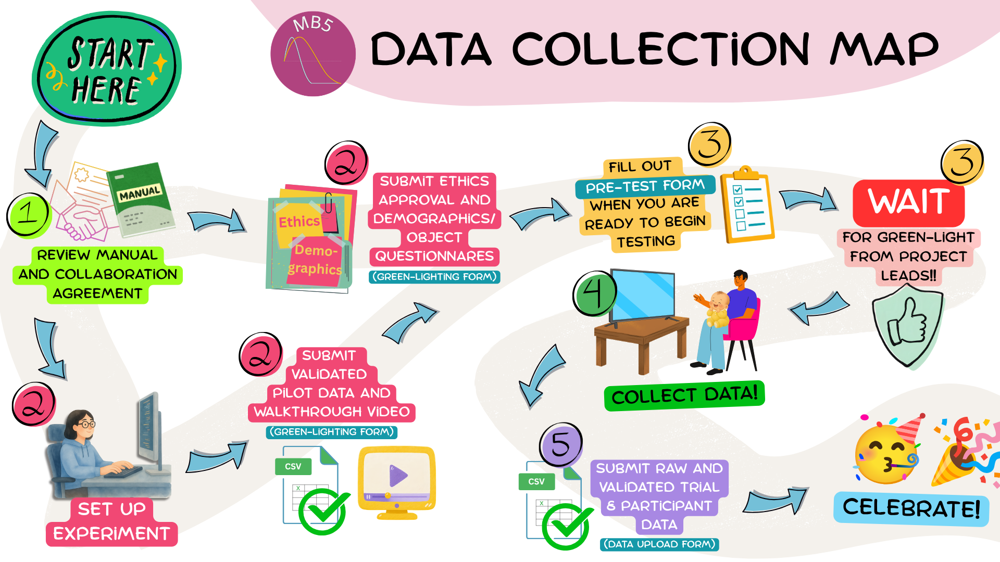

# Lab participation overview {#sec-laboverview}

::: callout-important
# These are the steps that every data-collecting lab must follow to participate in . This is just an OVERVIEW of the process. More detail for each step is available in the linked sections.
:::

{#fig-map}

(@) ### BEFORE you do ANYTHING else: 

* Read this manual start to finish, including the [** Collaboration Agreement**](){target="_blank"} 
* Review the [**ManyBabies General Manual**](){target="_blank"}, especially the  and information regarding <a href="https://docs.google.com/document/d/1dZ3sF2UcxvpkfOfKSKFeObTMZRbpUYloMUiPYtZy0ng/edit#heading=h.22i70rxou3ha" target="_blank">ethical research</a>, <a href="https://docs.google.com/document/d/1dZ3sF2UcxvpkfOfKSKFeObTMZRbpUYloMUiPYtZy0ng/edit#heading=h.9ty2g48mpe0t" target="_blank">authorship</a>, <a href="https://docs.google.com/document/d/1dZ3sF2UcxvpkfOfKSKFeObTMZRbpUYloMUiPYtZy0ng/edit#heading=h.aunbjkpwxhf3" target="_blank">data sharing</a>, and <a href="https://docs.google.com/document/d/1dZ3sF2UcxvpkfOfKSKFeObTMZRbpUYloMUiPYtZy0ng/edit#heading=h.6h67zsyeiveg" target="_blank">data use</a>
* **By participating in this project, you agree to abide by the terms outlined in these documents.**
* Complete the [** Sign-Up Form**](){target="_blank"}

(@) ### PREPARE study materials: 
* Submit the versions of the **demographics questionnaire** (see @sec-demographics) and **object experience questionnaire **(see @sec-objects) your lab will be using, your lab's **ethics approval** (see @sec-ethics), and any other relevant documentation/materials
* **Set up the experiment** in consultation with this lab manual (see [Setting up the Experiment](#sec-setup)) 
* Create and submit your **walkthrough video** (see @sec-walkthrough)
* Run **pilot data** through the  and submit (see @sec-validation)

(@) ### SIGNAL to Project Leads that you are ready to begin testing
* Fill out the  to provide final testing information and let Project Leads know that you are ready for “Green-Lighting”

:::{.callout-important}
# WAIT! 
## DO NOT BEGIN DATA COLLECTION (other than piloting) until your lab has been explicitly given the “Green-Light” to do so by the Project Leads. {.mark .unnumbered}

**Data collected prior to "Green-Lighting" WILL NOT be included in analyses.**
:::

(@) ### COLLECT DATA: 

* **ONLY AFTER YOUR LAB HAS BEEN GIVEN A "GREEN-LIGHT":** Collect your data following the guidelines in the [Running the experiment](#sec-running) section

(@) ### SUBMIT DATA: 

* Compile your participant and trial data files in consultation with data reporting guidelines (see @sec-datareporting and @sec-datatemplates)
* Verify your data files using the  (see @sec-validation)
* Submit your data using the  (see @sec-datasubmission)
* Report individual contributions using the 
